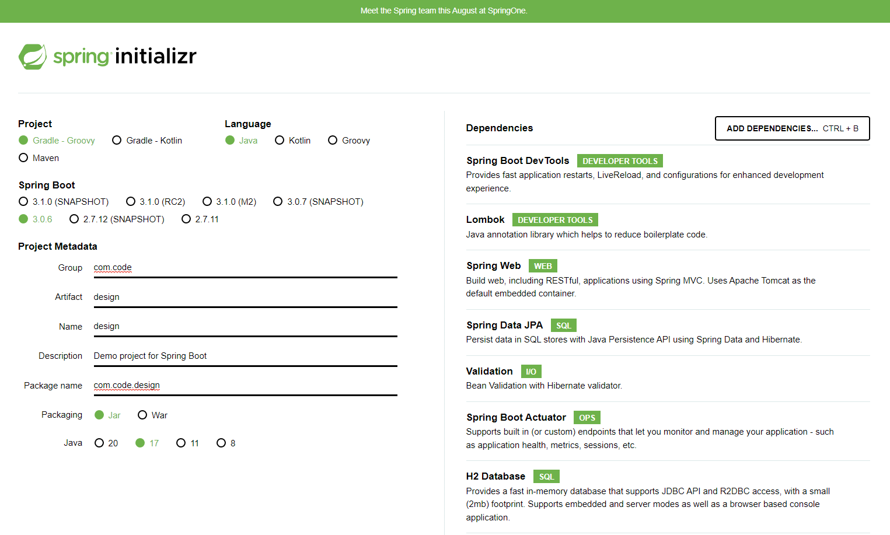
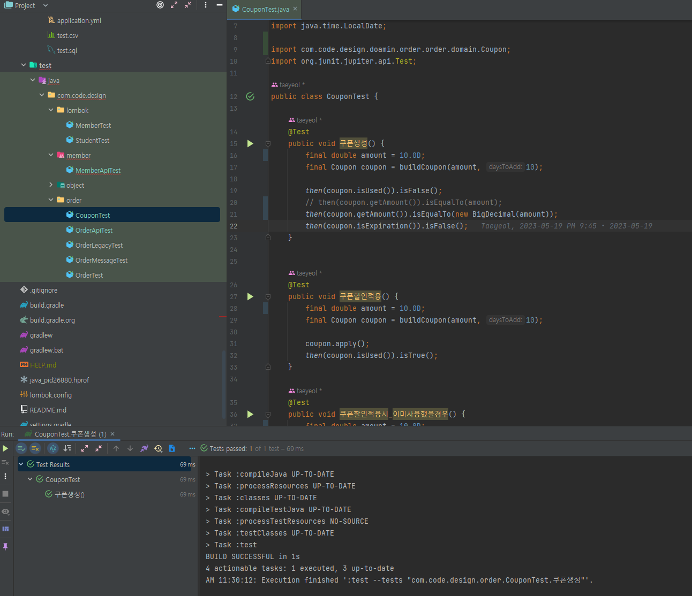
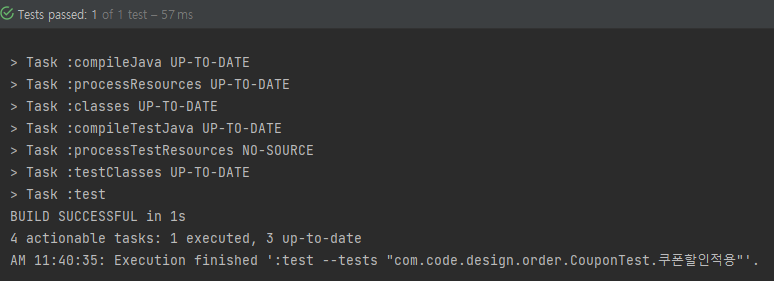
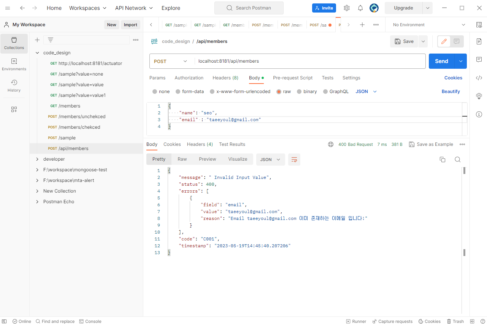
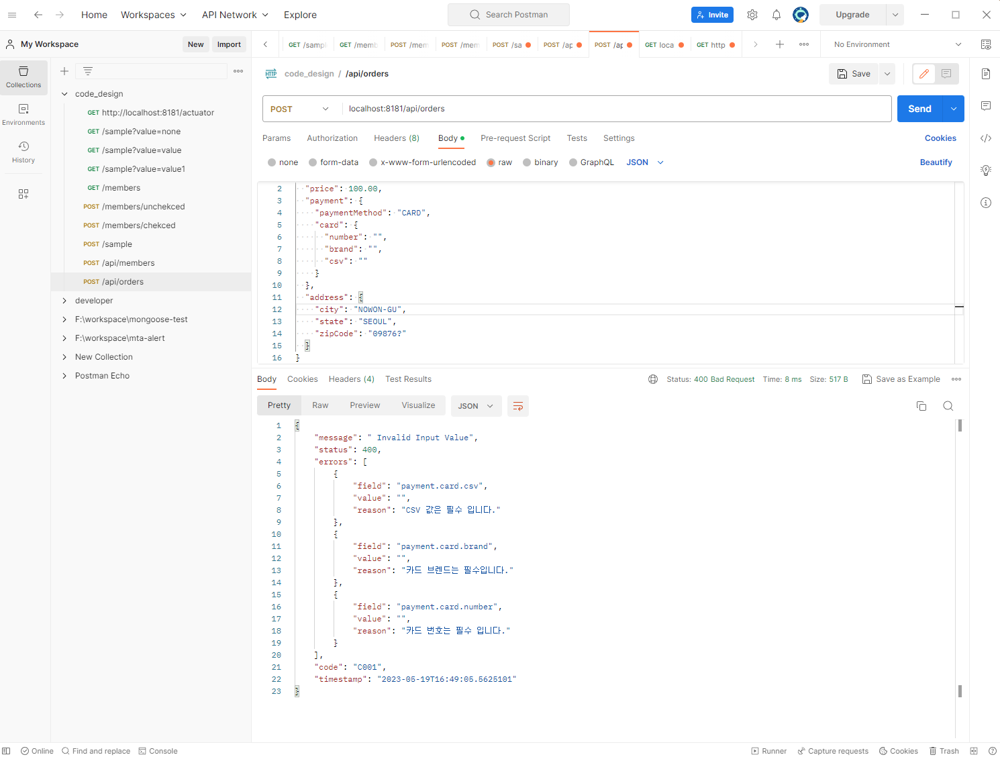
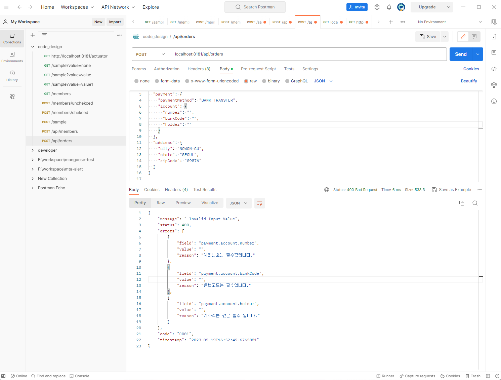

# 유지보수하기 좋은 코드 디자인


> [패스트 캠퍼스 유지보수하기 좋은 코드 디자인](https://github.com/cheese10yun/code-design)  
> [Spring Guide - Directory 패키기 구조 가이드](https://cheese10yun.github.io/spring-guide-directory/#null)  

## 패키지 구조

### 권장하는 도메인 구조
- domain : 도메인을 담당
- global : 프로젝트의 전체 담당
- infra : 외부 인프라스트럭처 담당

### Domain 하부 구조
#### domain
- common
  - 공통으로 사용되는 Value 객체들로 구성
  - 페이징 처리를 위한 Request, 공통된 응답을 주는 Response 객체들이 있음
- config
  - 스프링 각종 설정들로 구성
- api
    - 컨트롤러 클래스들이 존재 합니다.
- application
  - Service 클래스  
  - 도메인 객체와 외부 영역을 연결해주는 파사드와 같은 역할을 주로 담당하는 클래스로 구성  
- domain
    - 도메인 엔티티에 대한 클래스로 구성,
    - 특정 도메인에만 속하는 Embeddable, Enum 같은 클래스도 구성
- dto
    - 주로 Request, Response 객체들로 구성
    - repository 와 비슷
    - repository로 하지 않은 이유는 조회 전용 구현체들이 많이 작성
- exception
    - 해당 도메인이 발생시키는 Exception 으로 구성
#### global
- 프로젝트 전제에서 사용되는 객체들로 구성
- common
    - 공통으로 사용되는 Value 객체들로 구성
    - 페이징 처리를 위한 Request
    - 공통된 응답을 주는 Response 객체
- config
    - 스프링 각종 설정들로 구성
- error
    - 예외 핸들링을 담당하는 클래스로 구성
    - Exception Guide 에서 설명했던 코드들이 있음
- util
    - 유틸성 클래스
#### infra
    - infrastructure 관련된 코드들로 구성  
    - 대표적으로 이메일 알림, SMS 알림 등 외부 서비스에 대한 코드들이 존재  
    - 그렇기 때문에 domain, global에 속하지 않고, 이 계층도 잘 관리해야 하는 대상이기에 별도의 디렉터리로 분리  
    - SMS 메시지를 보내는 클라이언트   
        - 국내 사용자에게는 KT SMS  
        - 해외 사용자에게는 Amazon SMS  



## 코드
- com.code.design
    - domain
        - member
        - model
        - order

## 객체를 풍부하게 표현하기
- 본인의 역활과 책임, 그 의도를 잘 드러내는 것
### Lombok 사용시 주의 사항
- Lombok 을 잘 사용해야 객체 디자인을 망치지 않는다.
#### `@Data` 는 지양하자
#### 무분별한 @Setter 남용  
- Setter 는 그 의도가 분명하지 않고 객체를 언제든지 변경할 수 있는 상태가 되어서 객체의 안전성이 보장받기 힘듭니다.
#### ToString 양방향 순환 참조 문제
#### @EqualsAndHashCode 의 남발 ...
#### 클래스 상낟의 @Builder 는 지양하자  - 무엇이 문제이고
#### lombok.config 설정을 통해서 제한하자

---
Exception 처리를 왜 해야할까요?  
Check Exception VS UnChecked Exception  

##  오류 코드 코드보다 예외를 사용하라
### Clean Code 예제
```java
public class DeviceController {
    ...
    public void sendShutDown() {
        DeviceHandle handle = getHandle(DEV1);
        // 디바이스 상태를 점검한댜.
        if (handle != DeviceHandle.INVALID) {
            // 레코드 필드에 디바이스 상태를 저장한다.
            retrieveDeviceRecord(handle);
            // 디바이스가 일시정지 상태가 아니라면 종료한다.
            if (record.getStatus() != DEVICE_SUSPENDED) {
                pauseDevice(handle);
                clearDeviceWorkQueue(handle);
                closeDevice(handle);
            } else {
                logger.log("Device suspended. Unable to shut down");
            }
        } else {
            logger.log("Invalid handle for: " + DEV1.toString());
        }
    }
    ...
}
```
- 비지니스 로직과 오류 처리 코드가 함께 있어 코드가 복잡하하다
- 무슨 오류가 있는지 명확하게 파악이 힘들다.

### 예외를 사용하여 로직은 끊음
```java
public class DeviceController {
	...
	public void sendShutDown() {
		try {
			tryToShutDown();
		}
        catch (DeviceShutDownError e) {          
			// 적절한 Exception을 발생시키는것이 더 바람직하다.
            logger.log(e);
		}
	}

	private void tryToShutDown() throws DeviceShutDownError {
		DeviceHandle handle = getHandle(DEV1);
		DeviceRecord record = retrieveDeviceRecord(handle); 
		pauseDevice(handle); 
		clearDeviceWorkQueue(handle); 
		closeDevice(handle);
	}

	private DeviceHandle getHandle(DeviceID id) {
		...
		throw new DeviceShutDownError("Invalid handle for: " + id.toString());
		...
	}
```
- 비지니스 코드와 오류 처리 코드가 분리되어 가독성이 좋다
- 무슨 예외가 왜 발생하는지 명확해짐

#### Try/Catch
1. try catch를 최대한 지양해라.(로직으로 예외 처리가 가능하다면)
2. try catch를 하는데 아무런 처리가 없다면 로그라도 추가하자
3. try catch를 사용하게 된다면, 더 구체적인 예외를 발생시키는것이 좋다. (Exception 직접 정의 or Error Message를 명확하게)

### Check Exception VS UnChecked Exception
| 항목 | Checked Exception | Uncheked Exception |    
|:---|:---|:---|  
| 처리 여부            | 반드시 예외 처리 해야함 | 예외 처리 하지 않아도 됨 |  
| 트랜잭션 Rollback 여부 | Rollback 안됨 | Rollback 진행 |  
| 대표 Exception     | IOException, </br> SQLException | NullPointerException, </br> IllegalArgmentException |  

---

## 통일된 Error Response 를 가져야하는 이유
- 모양이 틀리면 Client 에서 처리해야 하는 
  - 200
  - 4XX
    - 400
    - 401
    - 404
  - 5XX
- 시스템 내부적인 오류는 숨기고, 가공된 메시지가 내려가는 것이 좋음

## 비지니스 예외릉 위한 최상위 BusinessException 클래스
- 풍부한 메시지, 상태값을 전달하여 추가적인 처리할 수 있도록 함
- Exception 을 늘리기보다는 가능하면 최상위 클래스로 처리하는 것이 좋음
### 예시
- Exception
  - RuntimeException
    - BusinessException
      - InvalidValueException
        - CouponAlreadyUseException
        - CouponExpireException
      - EntityNotFoundException
        - MemberNotFoundException
        - CouponNotFoundException
        - EmailNotFoundException

  
  


## Custom Validation 어노테이션 만들기
- 카드결제, 무통장 결제 예시에서는 NonNull Annotation 을 같은 항목에 적용 불가능한 경우를 예시로 들어 작성  
- 중복된 코드 제거
- email custom annotation 을 사용한 validation
      
- card/bank custom annotation 을 사용한 validation  
    
    

## 자신의 책임과 의도가 명확한 객체 디자인
### 인터페이스 이유
- 세부 구현체를 숨기고 인터페이스를 바라보게 함으로써 클래스간의 의존관계를 줄이는 것
- 인터페이스를 구현하는 여러 구현체가 있고 기능에 따라 적적한 구현체가 들어가서 다형성을 주기 위함
1. 적절한 객체의 크기를 찾아가는 여정
2. 객체는 협력 관계를 유지해야 한다
3. 묻지 말고 시켜라!
    - 객체는 협력적이다.
    - 복종하는 관계가 아님

---

## 시스템 내 강결합 문제 해결
### ApplicationEventPublisher 를 이용한 시스템 내의 강결합 문제 해결
- Kafka
- RabbitMQ
- Spring 제공
  - ApplicationEventPublisher
  - ApplicationEventListener
- 회원가입
  - 회원 가입
  - 회원가입 쿠폰발행
  - ApplicationEventPushisher
- 회원 가입 완료 이후
  - ApplicationEventListner
  - 회원 가입 이메일 전송

### @TransactionalEventListener 를 이용한 트랜잭션 문제 해결
- 해당 트랜잭션이 Commit 된 이후에 리스너가 동작
- 예외가 발생하게 된다면 트랜잭션 Commit 이 진행되지 않기 때문에 해당 리스너가 동자가지 않게 되어 트랜잭션 문제를 해결할 수 있음

### @Async Annotation 사용으로 @Transactional 로 묶인 Transaction 의 성능, 


## gradle
```
gradle clean build --warning-mode all     
gradle bootRun  
```